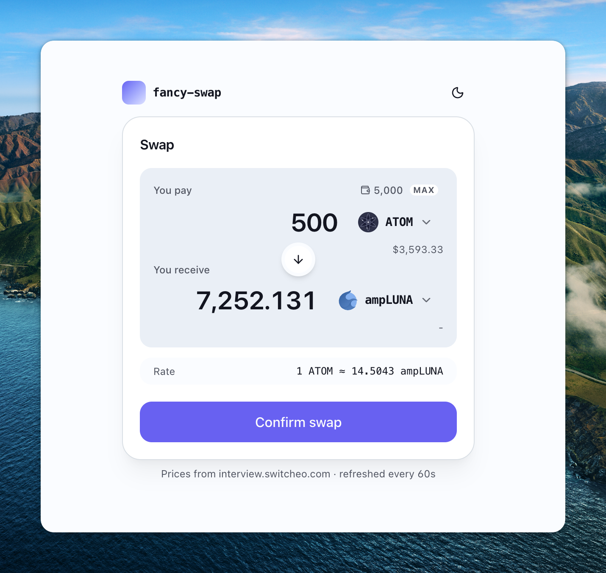

# 99Tech Code Challenge #1: Submission

Submission for the Frontend Engineer position. Problems 1-3 are the relevant
scope for an FE role; Problems 4 and 5 are intentionally out of scope.

**Problem 2 is deployed:** https://fancy-swap-challenge.vercel.app/



## Quickstart

Each problem is self-contained: `cd src/problemN`, then `npm install && npm test`.

```bash
# Problem 1: Sum to N (TypeScript, 5 variants, benchmarked)
(cd src/problem1 && npm install && npm test && npm run bench)

# Problem 2: Fancy Swap (React 19 + Vite 8 + Tailwind v4)
(cd src/problem2/fancy-swap && npm install && npm test)
(cd src/problem2/fancy-swap && npm run dev)    # http://localhost:5173

# Problem 3: Messy React refactor (runnable + tests)
(cd src/problem3 && npm install && npm test)
```

Total: **83 tests**, all green, across the three problems.

| Problem | Tests | Build | Notes |
|---|---|---|---|
| 1. Sum to N | 46 | `npm run typecheck` | 5 variants + benchmark + edge cases |
| 2. Fancy Swap | 27 | `npm run build` | Real Switcheo prices, dark mode, a11y |
| 3. Messy React | 10 | `npm run typecheck` | `messy.tsx` + `refactored.tsx` + analysis |

## What each problem ships

### `src/problem1/`: Three Ways to Sum to `n`
- `sum_to_n.ts`, five variants: iterative, formula (Gauss), reduce,
  recursive (with documented stack-overflow), BigInt-safe.
- `sum_to_n.test.ts`, 46 tests covering known values, cross-variant
  equivalence, edge cases, validation, safe-integer boundary.
- `benchmark.ts`, micro-benchmark printing a markdown table. Real
  numbers in `README.md`.

### `src/problem2/fancy-swap/`: Currency Swap UI
- **React 19 + Vite 8 + TypeScript 6 + Tailwind v4 + shadcn-style
  primitives.**
- Fetches **real Switcheo prices** via TanStack Query v5.
- Token selector with debounced search and virtualised list
  (`react-window` v2).
- USD equivalents, exchange-rate row, MAX button, animated swap-direction
  button (`motion`), inline validation (`react-hook-form` + Zod),
  toast confirmation (`sonner`).
- Dark mode with OKLCH design tokens, responsive, a11y-aware
  (Radix Dialog focus-trap, `aria-live` rate row).
- Tested with Vitest + RTL.
- Shipped with a multi-stage `Dockerfile` (Node 22 build, nginx 1.27
  runtime on port 8080, non-root user, security headers, SPA fallback).
  Run locally with `docker build -t fancy-swap . && docker run --rm -p 8080:8080 fancy-swap`.

### `src/problem3/`: Messy React Refactor
- `messy.tsx`, the original `WalletPage` with all 15+ defects intact,
  each annotated `// BUG #N`.
- `refactored.tsx`, clean rewrite with `// FIX #N` markers mapping to
  `ANALYSIS.md`.
- `ANALYSIS.md`, issue-by-issue write-up: *what / why / fix*.
- `refactored.test.tsx`, 10 behavioural tests locking the fix (pure
  filtering/sorting/formatting + rendered output + empty state).

## Versions

All `package.json` files install `@latest` and let the lockfile pin
exact versions. Relevant majors as of 2026-05-13:

| Package | Version |
|---|---|
| React | 19.2 |
| Vite | 8.0 |
| TypeScript | 6.0 |
| Tailwind CSS | 4.3 |
| Vitest | 4.1 |
| TanStack Query | 5.100 |
| Zod | 4.4 |
| react-hook-form | 7.75 |
| motion | 12.38 |
| react-window | 2.2 |

Per-problem `package.json` lists everything else.

## Repo layout

```
src/
├── problem1/                # Sum to N, TS + Vitest + benchmark
├── problem2/
│   └── fancy-swap/          # React 19 swap UI
└── problem3/                # Messy React, messy + refactored + analysis + tests
```

## Submission

This repository contains my solution to the
[99Tech Code Challenge #1](https://github.com/99techteam/code-challenge)
for the Frontend Engineer position.

Each problem subfolder is self-contained; a reviewer can pick any one
and run it in isolation, with no cross-problem build or install steps.
